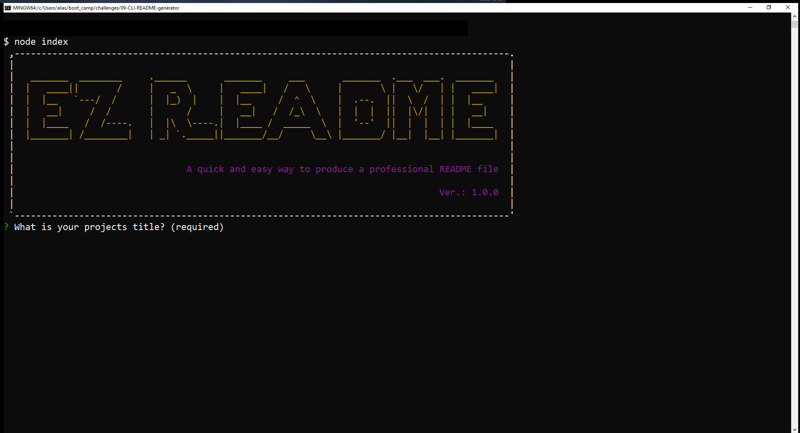

  # EZ README
  ### An application by H0RSESH0E 
  &nbsp;&nbsp;
  ## Description  
  This application is a quick and easy way to generate README.md and license.txt files for any programing application.  It includes a default screenshot option, support for license and language badges, integration with GitHub and creation of a separate license.txt file.  
  &nbsp;  
    
  &nbsp;  
      
       
  ## Table of Contents
  ### [Installation](#installation)  - [Usage](#usage) - [License](#license) - [Contributing](#contributing) - [Tests](#tests) - [Questions](#questions)
  &nbsp;
  ## Installation
  Once the application is live on NPM the following instructions will apply: After installing node.js, please use the 'npm init' command followed by 'npm i ezrm'.  For the present time installation can be achieved by cloning this repository and installing the necessary modules from npm.
  ## Usage
  There are no special instructions, however if you discover any bugs or have any ideas regarding enhancement, please forward them to me by email.
  ## License
  
    MIT License

Copyright (c) 2022 David Baron

Permission is hereby granted, free of charge, to any person obtaining a copy
of this software and associated documentation files (the "Software"), to deal
in the Software without restriction, including wit  
    [ . . . Click here to view the full license attached to this project.](license.txt)  
  ## Contributing
  There are no special requirements for contribution.  Please respect the licensing conditions.
  ## Tests
  Testing of the program is only manual at this time.
  ## Questions
  Questions or concerns about the project or how to contribute to its development can be emailed to: **dcpb777@gmail.com**  
  &nbsp;  
    
  **[Check out my repositories on GitHub](https://github.com/H0RSESH0E)** 
  
    